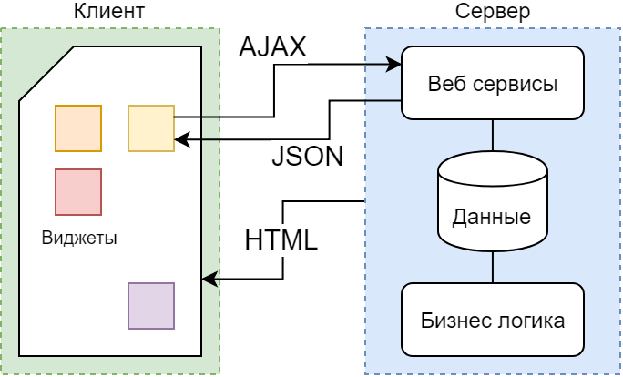
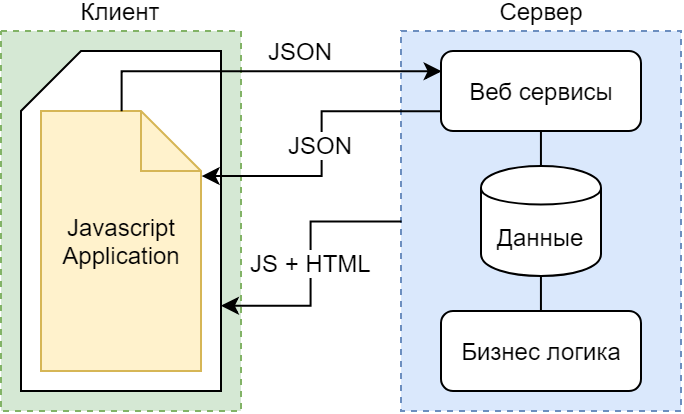
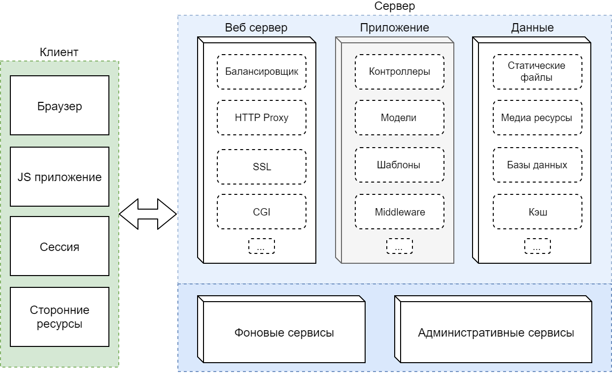

# Web Python

@fa[code fa-3x]

Веб приложения на Python. Flask и другие фреймворки.

> Часть первая

Note:

- Надо сделать тестовый рассказ и определиться, что войдёт в первую лекцию,
а что придётся сдвинуть
- какие интерактивные примеры можно привести, где разместить их в повествовании,
в каком формате подготовить

---

## Содержание

@ul

- Веб приложения
- Фреймворки
- Flask
- Django
- Deployment
- Микросервисы
- Практическое задание

@ulend

Note:

Для начала рассмотрим что из себя представляет веб приложение в целом;
какие бывают архитектурные и концептуальные подходы и т.п.

- Заострить внимание на применении и структуре приложений
- Какие из них мы рассмотрим подробней, на примере фреймворков питона
- Добавить NOTA BENE после каждой темы, с краткими выводами

---

## Web

- Общая идея
- Какие бывают приложения
- Архитектура

---

### Веб приложение это

Приложение, в котором клиент взаимодействует с сервером при помощи браузера.

@ul
- клиентская часть реализует пользовательский интерфейс, формирует запросы к серверу и обрабатывает ответы от него
- серверная часть получает запрос от клиента, выполняет требуемые действия, формирует ответ
@ulend

Note:

- обозначить понятия фронтенд и бэкенд
- немного про то, как это появилось и развивается

---

### Классическая схема


Note:

Клиент обращается к приложению, которое генерирует в ответ статический html

---

### Асинхронные виджеты



Note:

Отдельные элементы на странице обновляются асинхронно, через особые
взаимодействия с бэкендом

---

### Single Page Application



Note:

- фронтенд и бэкенд существуют отдельно друг от друга
- потенциально, бэкенд (или фронтенд) можно полностью заменить на другой, без
особых проблем
---

### Общая схема



Note:

- может включать в себя очень много чего
- в лекциях будем рассматривать преимущественно само "приложение"
- но также затронем и остальные моменты

---

### Веб приложения. Nota bene

@ul

- Frontend это HTML, CSS, JS - интерфейс для пользователя
- Backend предоставляет "интерфейс" для фронтенда
- На деле граница между ними бывает довольно размытой
- Последние тенденции как сближают, так и разделяют эти два компонента веб приложений

@ulend

Note:

Необходимо подвести к разделению на frontend/backend и рассказать подробней о
грани (или её отсутствии) между ними.

---

### Простейшие функции веб приложения (pending)

- отображение страниц
- авторизация
- отображение данных
- сохранение данных

Note:

- бесконечно много, рассмотрим основные

---


## Инструментарий

@ul

- Встроенные модули питона
- Flask
- Django
- Прочие (Bottle, Pyramids, Tornado)

@ulend

---

### HTTP server

Доступен "из коробки", реализован на основе `socketserver.TCPServer`

> python -m http.server 8000

---?code=src/1-http-server.py&lang=py&color=white&title=Http server

@[1-2](Импортируем socketserver и HTTP обработчик)
@[3-5](Модули логгирования и работы с файловой системой)
@[7](Назначим свою версию обработчика HTTP запросов)
@[9-11](Переопределяем метод GET)
@[13](Модифицируем стартовую директорию)
@[15-16](Запускаем сервер с нашим HTTP обработчиком)


Note:
- по умолчанию раздаёт текущую директорию или файл index.html
- модифицируем текущую директорию и метод GET

---

## Flask

@ul

- Установка и конфигурация
- Примеры функциональности
- Структура проекта
- Blueprints
- Готовые модули

@ulend

Note:

- почему Flask это микро-фреймворк
- Flask как проект-шутка (немного об истории)
- что включает в себя Flask

---

### Flask. Рабочее окружение

```bash
pip intall pipenv

pipenv install flask

pipenv shell
```

*Pipenv* - Священный союз Pipfile, Pip, и Virtualenv.

Note:

- для данного приложения задействуем виртуальное окружение
- дальше рассмотрим альтернативные варианты создания development окружения

<!-- ### Flask. Простое приложение -->

---?code=src/flask/1-simple.py&lang=py&color=white&title=Flask. Basics
@[1](Импортируем Flask и его утилиты)
@[3](Создаём приложение)
@[5-7](Назначаем маршрут 'Hello World')
@[9-11](Добавляем редирект с корневого url)
@[13-14]

<!-- ### Flask. Шаблон -->

---?code=src/flask/2-template.py&lang=py&color=white&title=Flask. Using templates
@[5](Обозначим данные)
@[9](Выведем данные в шаблон)

---?code=src/flask/templates/fish.html&lang=html&color=white&title=Flask. Template
@[1,2,12](Это HTML страница)
@[3-5](Назовём её согласно содержимому)
@[6-11](Выведем в цикле всех рыбок)

Note:

- файлы шаблонов надо где-то хранить
- шаблонизаторы и что это такое
- более подробно рассмотрим на примере шаблонизатора Django

<!-- Flask. Запросы -->

---?code=src/flask/3-request.py&lang=py&color=white&title=Flask. Request
@[1-2](Задействуем дополнительные модули Flask)
@[3-4](Для пущего удобства)
@[6-10](Эмулируем некое подобие сервиса для получения данных)
@[14-15](Назначаем маршрут для получения информации о записи)
@[16-18](Обрабатываем GET параметр)
@[19-21](Получаем запись из сервиса)
@[23-26](Форматируем и возвращаем данные в качестве ответа)
@[28-29,30,33](Маршрут для перечисления и добавления записей)
@[30-31](Выводим все имеющиеся записи)
@[35-38](Обрабатываем POST запрос)
@[34,40-41](Проверяем запрос на возможные ошибки)

---

### Flask. Пример запроса

> curl -d "name=corydoras&size=medium" -X POST http://localhost:5000/

Различные утилиты для HTTP запросов:

- cURL
- Postman
- Insomnia (бывший Hurl.it)

---

### Flask. Структура проекта

Необходимо обозначить практики для формирования приложения и альтернативные
варианты.

> cookiecutter

---

### Flask. Пример структуры проекта

```bash
.
├── example.env             # переменные окружения
├── run.py                  # точка входа в приложение
├── client.js               # точка входа для фронтенда
└── app
    ├── client
    │   ├── build           # артефакты фронтенда
    │   ├── static
    │   └── templates       # шаблоны
    └── server
        ├── config.py       # конфигурация приложения
        ├── main            # главный модуль
        ├── models.py       # модели данных
        └── user            # модуль пользователя
```

---

### Flask. Blueprints

Логический элемент приложения, обособленный согласно определённым факторам.

```bash
app/
    errors/                 # модуль ошибок
        __init__.py         # инициализация модуля
        handlers.py         # обработка ошибок
    templates/
        errors/             # шаблоны ошибок
            404.html
            500.html
    __init__.py             # регистрируем blueprint
```

<!-- Пример Blueprint'а -->

---?code=src/flask/4-blueprint.py&lang=py&color=white&title=Flask. Errors Blueprint
@[1-6](Инициализация модуля ошибок)
@[10-17](Пример обработчика ошибки 404)
@[20-25](Подключение модуля к основному приложеню)


---

### Flask. Готовые модули

Для расширения функциональности Flask доступно большое количество модулей:

@ul

- Flask-Login: сессия и авторизация
- Flask-Admin: административный интерфейс
- Flask-Restful: создание REST API
- Flask-SQLAlchemy: работа с базой данных
- Flask-Migrate: создание миграций

@ulend

---

## Django

@ul

- В чём отличие
- Установка и модули
- Консольная утилита
- Структура приложения
- База данных и миграции
- REST API

@ulend

---

## Django. Вступление

---

## Django. Создание проекта

---

## Django. Консольная утилита

---

## Django. Структура приложения

---

## Django. База данных, модели, миграции

---

## Deployment

@ul

- Gunicorn, wsgi
- Сервер nginx, reverse proxy
- Supervisor, systemd

@ulend

---

## Заключение

@ul

- Frontend + backend
- Типы приложений
- Микросервисы

@ulend

---

## Практика
---

### Задача #1.

Http-прокси сервер, запускаемый локально и отображающий
содержимое произвольного сайта, с одной лишь только разницей: после каждого
слова из 10 букв должен стоять значок trademark, он же ™.

**Hard mode**: приложение должно запускаться как консольная утилита с
некоторыми параметрами, на усмотрение автора (к примеру: целевой сайт, порт
прокси и т.п.)

---

### Задача #1. Инструментарий

- Git
- Virtualenv/Pipenv
- Bottle
- Requests
- BeautifulSoup
- Click

---

### Задача #2.

Приложение позволяющее отправить через веб-форму некоторый текст, выдающее на
его основе набор комбинаций сформированных через марковские цепи.

@color[gray](
**Hard mode**: исходные данные и результирующие комбинации должны храниться в
базе данных и быть доступны для просмотра через некую историю сабмитов.
)

---

### Задача #2. Инструментарий

- Git
- Virtualenv/Pipenv
- Flask/Django
- Sqlite
- Markovify

---

## Ссылки

Данная презентация
https://gitpitch.com/xifax/lectures-python-web/master

Репозиторий презентации
https://github.com/xifax/lectures-python-web
