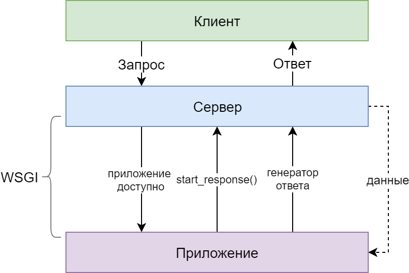
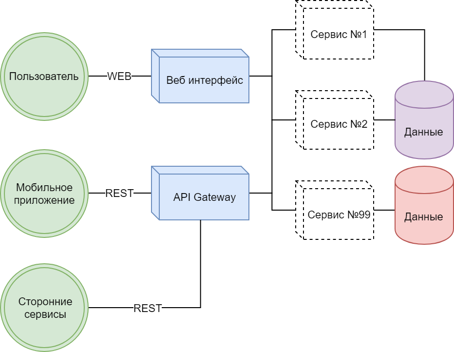
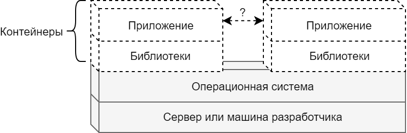

# Web Python

@fa[code fa-3x]

Веб приложения на Python. Flask и Django.

> Часть вторая

---

## В предыдущей лекции

@ul

- Различные (преимущественно непонятные) варианты построения приложения
- Что собственно делают веб приложения
- Как они это делают, на примерах
- Python, Flask и немножко JS

@ulend

---?image=img/1-reinhardt.jpg&size=contain

<!--
 ####################################################
 ################### Часть вторая ###################
 ####################################################
 -->

---

## Содержание

@ul

- Django
- Прочие фреймворки
- Deployment
- Виртуальное окружение, контейнеры и т.п.
- Практические задания №3, 4

@ulend

---

## Django

@ul

- В чём отличие
- Установка и модули
- Консольная утилита
- Структура приложения
- База данных и миграции
- REST API

@ulend

---

### Django. Вступление

@ul

- Административный и консольный интерфейсы
- ORM для базы данных и миграции
- Базовый пользователь и аутентификация
- Пользовательские сессии
- Множество middleware для различных целей
- i18n, l10n
- "Это надо делать вот так"

@ulend

Note:

- Чем локализация отличается от интернационализации
- Фреймворк для перфекционистов с дедлайнами

---

### Django. Структура

@ul

- Веб процесс
  + User/admin/API интерфейсы
  + Работа с базой данных
- Утилиты
  + Управление приложением
  + Локализация, миграции, инструментарий
- Фоновые процессы
  + Отложенные задачи
  + Периодические задачи

@ulend

---

### Django. Идея приложения

@ul

- создаём и назначаем задачи для выполнения
- подразделяем пользователей на студентов и прочих
- разграничиваем доступ к различным страницам
- группируем студентов и задачи по определённым признакам
- добавим утилиты массовой обработки задач

@ulend

---

### Django. Создание проекта


> django-admin startproject lessons .

или же

> cookiecutter github.com/cool-repo-template.git

затем

> django-admin startapp tasks

Note:

- обратить внимание на структуру проекта
- сравнить с Flask'ом и прочими фреймворками

---

### Django. Проект и приложение

```bash
.
├── lessons           # база
│   ├── settings.py   # глобальные настройки
│   ├── urls.py       # маршруты
│   └── wsgi.py       # WSGI приложение
├── manage.py         # консольная утилита
└── tasks             # приложение а-ля blueprint
    ├── admin.py      # настройки CRUD'а
    ├── apps.py       # настройки приложения
    ├── migrations    # модификации базы данных
    │   └── ...
    ├── models.py     # модели для доступа к БД
    ├── templates     # шаблоны и представления
    │   └── ...
    ├── tests.py
    ├── urls.py
    └── views.py      # страницы приложения
```
@[2,7](Модули проекта)
@[3,9](Настройки)
@[4,16](Маршруты)
@[5,6](WSGI приложение и основная точка входа)

---

### Django. Структура приложения

```bash
appN
.
├── backend               # для администраторов
│   └── dashboard.py
├── forms                 # формы и валидаторы
│   └── register_form.py
├── frontend              # статические ресурсы
│   ├── images
│   ├── ...
│   └── styles
├── management            # консольные команды
│   └── commands
├── middleware            # обработчики запроса
│   └── visits_tracker.py
├── migrations
│   └── 0666_preferences_appN_image.py
├── models
│   └── preferences.py
├── services              # логика данного приложения
│   └── preferences.py
├── templates             # шаблоны
│   └── admin
├── utils
└── views
    └── api.py

```
@[19-20,25](Вместо отдельных файлов используем модули)
@[7-10](Отдельная папка для клиентского представления)
@[13-14](Промежуточные обработчики запроса пользователя)
@[19-20](Бизнес-логика приложения вынесена отдельно)

Note:

- рассказать про переменные окружения и разные варианты конфигурации
- упомянуть классы для окружения, переменные, python-decouple

---

### Django. Консольная утилита

> python manage.py

@ul

- Запуск приложения
- REPL в окружении приложения
- Дополнительная инициализация приложений
- Генерация миграций, переводов
- Пользовательские команды

@ulend

---

### Django. База данных, модели, миграции

TODO: Что такое ORM и чем он может быть полезен.

---

### Django. Тестируем модели

TODO: тесты для проверки логики полей и связей

---

### Django. Маршруты

---

### Django. Шаблоны

---

### Django. Различные практики

TODO: описать django-env, configurations, middleware, etc

---

### Django. Подготовка к релизу

TODO: сбор статических ресурсов, переводы и т.п.

---

### Django. Выводы

@ul
@ulend

---

## Прочие фреймворки

@ul

- Pyramids
- Eve
- Tornado

@ulend

---

### Pyramids

Рассказать про модульность

---

### Eve

Основное назначение: REST API

---

### Tornado

Асинхронный и потому не основан на WSGI

---

## Deployment

Веб-приложение необходимо и желательно запустить на мастер-сервере

@ul

- WSGI, Gunicorn
- Сервер nginx, reverse proxy
- Supervisor, systemd

@ulend

---

### Web Server Gateway Interface



Note:

- Описывает взаимодействие между веб-сервером и приложением на Python
- немного про CGI, fastCGI и прочее
- WSGI "импортирует" веб приложение

---

### Преимущества

@ul

- Гибкость: можем менять компоненты стэка
- Масштабируемость: компенсирует недостатки фреймворка
- Простота: явное разделение на компоненты системы
- Позволяет задействовать разнообразные middleware
- Хорошо вписывается в микросервисную архитектуру

@ulend

---

### Gunicorn

*Green Unicorn*. Pre-fork модель со множеством worker'ов

> pipenv install gunicorn

> gunicorn --workers 4 project:app

> gunicorn --pid /path/to/pid --bind unix:/path/to/socket app.wsgi

Note:

- также можно задать нужные параметры отдельным конфигурационным файлом
- зачем нам может понадобиться process id и сокет
- вазимодействие между приложениями

---

### Nginx

@ul

- Веб сервер для статического контента
- Прокси-сервер для динамических сайтов

@ulend

---?code=src/deploy/nginx.conf&lang=conf&color=white&title=Nginx server block
@[1-9](Обратный прокси для веб приложения)
@[2-3](Конфигурация домена)
@[5-8](Конфигурация прокси на порт 8000)
@[18](Тоже самое, но через сокет)
@[21-23](Доступ к статическим файлам вроде картинок)

---

### Systemd

@ul

- Системный менеджер Linux
- Позволяет запускать разнообразные службы и контроллировать их выполнение
- Оперирует отдельными конфигурационными Unit'ами
- Поддерживает различные типы Unit'ов

@ulend

Note:

Можно немного рассказать про типы unit'ов

---?code=src/deploy/gunicorn.service&lang=ini&color=white&title=Gunicorn service
@[1-3](Данный Unit зависит от сетевого сервиса)
@[5-12](Обозначим наш сервис)
@[8-12](Где и что будем запускать)
@[14-15](Запускаем данный сервис при обычной загрузке)

Note:

Multiline использован исключительно для примера

---

### Запуск сервиса

```bash
> sudo systemctl start gunicorn.service

> sudo systemctl status gunicorn.service

● gunicorn.service - gunicorn daemon
   Loaded: loaded (/etc/systemd/system/gunicorn.service; enabled; vendor preset: enabled)
   Active: active (running) since Sun 2018-07-08 17:02:43 MSK; 2 weeks 4 days ago
 Main PID: 21092 (gunicorn)
    Tasks: 11
   Memory: 393.0M
      CPU: 2h 39min 18.768s
   CGroup: /system.slice/gunicorn.service
           ├─21092 /path/.../venv/bin/python /path/.../gunicorn --workers 4 --bin
           ├─21092 /path/.../venv/bin/python /path/.../gunicorn --workers 4 --bin
           ...

> sudo systemctl enable gunicorn.service
```
@[1](Запускаем сервис)
@[3-15](Убеждаемся, что он работает)


---

## Заключение

@ul

- Vagrant
- Docker
- Примеры и демонстрация
- Микросервисы

@ulend

---

### Vagrant. Виртуальная среда разработки

@ul

- "песочница" под нужды проекта
- одинаковое окружение где бы то ни было
- простота развёртывания среды разработки

@ulend

---

### Микросервисы



---
### Docker

@ul

- виртуализация на уровне ОС
- меньшая требовательность к ресурсам
- возможность размножения контейнеров

@ulend

Note:

- в чём преимущества в сравнении с полноценной виртуальной машиной а-ля Vagrant
- добавить схему контейнеров и взаимодействия

---

### Docker. Контейнеры



---

### Docker. Клиент & Сервер

Разделим клиент и сервер, поместив каждый из них в отдельный контейнер

@ul

- сервер работает с информацией и предоставляет API
- клиент отвечает за представление информации конечному пользователю

@ulend

<!-- ### Docker. Flask API -->

---?code=src/docker/api/app.py&lang=py&color=white&title=Flask API
@[2](Инструменты для создания API)
@[7-14](Эти данные мы потенциально могли бы получить из БД на другом контейнере)
@[15](Добавим как корневой маршрут)
@[18](Запустим на 80-м порту с локальным мета-адресом)

---?code=src/docker/api/Dockerfile&color=white&title=Dockerfile
@[1](Готовый образ с Python)
@[3-4](Рабочая директория приложения)
@[6-7](Установим зависимости через Pipenv)

Note:

Можно упомянуть CMD прочие интересные инструкции docker'а

<!-- ### Docker. Flask client -->

---?code=src/docker/client/app.py&lang=py&color=white&title=Bottle client
@[1-2](Импортируем фреймворк и утилиту для работы с API)
@[4-5](Корневой маршрут для отображения данных)
@[7-9](Получаем данные из другого контейнера)
@[10](Выводим их в шаблон)
@[12](Запустим приложение на другом порту)

<!-- ### Docker. Flask client. Template -->
---?code=src/docker/client/poets.tpl&lang=html&color=white&title=Bottle client template
@[13-15](Bottle использует SimpleTemplateEngine)

<!-- ### Docker. Compose -->

---?code=src/docker/docker-compose.yml&lang=yaml&color=white&title=Docker compose file
@[3-4,12](Обозначим наши сервисы-контейнеры)
@[5](Директория в которой находится Dockerfile)
@[6](Команда запуска нашего приложения)
@[8-9](Свяжем локальный путь с каталогом в самом контейнере)
@[10-11](Снаружи 80-й порт будет доступен как 5000-й)
@[19-29](Клиенту необходим API для работы)

Note:

- два типа volume, для чего может быть полезно
- автообновление приложений при изменении кода

---

### Docker. Запуск

> docker-compose build

> docker-compose up --detatch

> docker-compose ps

```bash
Name            Command      State           Ports
----------------------------------------------------------------
docker_api_1      python app.py   Up      0.0.0.0:5000->80/tcp
docker_client_1   python app.py   Up      0.0.0.0:5001->8080/tcp
```

---

## Практика

---

### Задача №3.

Приложение, позволяющее отправить через веб-форму некоторый текст.
 После успешного сабмита выдающее на основе полученного текста набор комбинаций,
  сформированных через марковские цепи.

Пример: https://twitter.com/mashomatic

---

**Hard mode**:

- исходные данные и результирующие комбинации должны храниться в
базе данных и быть доступны для просмотра через некую историю сабмитов
- все когда либо отправленные тексты также используются при генерации новых
сообщений

---

### Задача №3. Инструментарий

- Git
- Virtualenv/Pipenv
- Flask/Django
- Markovify
- Sqlite

---

### Задача №4.

Приложение разбивающее входной текст (из формы) и генерирующее
QR код для каждого отдельного слова (не меньше определённого размера).
Полученные коды сохраняются как картинки в некоторую папку доступную приложению.
К сгенерированным кодам можно получить доступ непосредственно через веб приложение.

---

**Hard mode**:

- Реализовать фоновую генерацию для большого количества кодов
- Совершать некое дополнительное действие по завершению генерации кодов (архивация, отправка сообщения и т.п.)
- Добавить асинхронное уведомление для пользователя по завершению генерации кодов

---

### Задача №5.

Доработать приложение из примера и реализовать обещанный экран группировки
студентов и задач, задач и тем.

---

**Hard mode**:

- Попробовать задействовать другую базу данных
- Добавить механизм генерации тестовых данных, дабы не вбивать всё руками
- Добавить пагинацию для большого количества результатов

## Ссылки

Данная презентация
https://gitpitch.com/xifax/lectures-python-web/master

Репозиторий презентации
https://github.com/xifax/lectures-python-web

Репозиторий содержит примеры кода, картинки, тексты и "заметки на полях".
