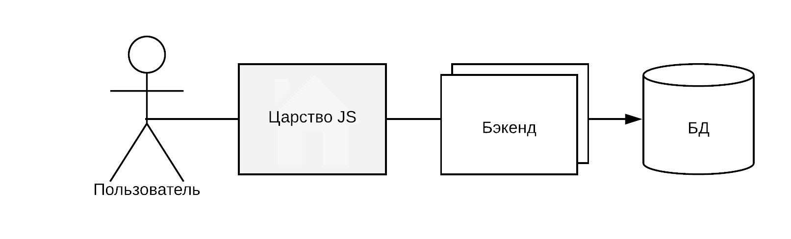

# Web Python

Веб приложения на питоне и с чем их едят

> Предварительный набросок

---

## Предварительное содержание

@ul

- Что такое веб приложение
- Фреймворки
- Flask
- Django
- Развёртывание на сервере
- Микросервисы
- Практическое задание

@ulend

Note:

- Заострить внимание на применении и структуре приложений
- Добавить NOTA BENE после каждой темы

---

### Что такое веб приложение

- Компоненты веба
- Встроенные модули питона

---

### Симпатичная (условно) схема



---

### SimpleHTTPServer

@[1-2]
@[4]
@[6-7]
@[9-10]
```
import SimpleHTTPServer
import SocketServer

PORT = 8000

Handler = SimpleHTTPServer.SimpleHTTPRequestHandler
httpd = SocketServer.TCPServer(("", PORT), Handler)

print "serving at port", PORT
httpd.serve_forever()
```


или

> python -m SimpleHTTPServer 8000

---

## Flask


@ul

- Установка и конфигурация
- Шаблон проект и базовое устройство
- Готовые модули
- Blueprints

@ulend

---

## Django

@ul

- В чём отличие
- Консольная утилита
- Установка и модули
- База данных и миграции

@ulend

---

## Deployment

@ul

- Gunicorn, wsgi
- Сервер nginx, reverse proxy
- Supervisor, systemd

@ulend

---

## Заключение

@ul

- Frontend + backend
- Типы приложений
- Микросервисы

@ulend

---

## Задача

...

---

## Ссылки


